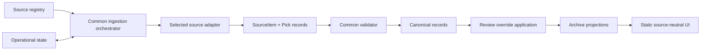

# ManaIntel Multi-Source Architecture

Status: living architecture record<br>
Last reviewed: 2026-07-27

## Purpose

ManaIntel is a static archive of explicit MTG finance picks. It currently ingests
two podcast sources:

1. MTG Fast Finance (FFW)
2. Brainstorm Brewery (BB)

This document records what is implemented now, the boundaries that should remain
stable, and the larger adapter design required before adding a non-podcast source.
It is not authorization to implement every deferred phase.

## Product boundary

ManaIntel publishes a pick only when a source explicitly recommends an action or
stance on a card. Discussion, price movement, deck popularity, metagame data,
EDHREC trends, Reddit sentiment, Discord chatter, and inferred recommendations are
not picks.

The archive summarizes source commentary; it does not add ManaIntel investment
opinions. Unknown values remain unknown, and users should be able to verify a pick
against its source.

## Current implementation

The current architecture is a pragmatic two-podcast extension of the original FFW
pipeline. It is not yet the fully generic `SourceAdapter` architecture described
later in this document.

```text
FFW RSS --------------------+
                            +-> combined discovery -> shared podcast pipeline
BB RSS + extraction profile +        |
                                     +-> guarded download
                                     +-> audio preparation/chunking
                                     +-> transcription
                                     +-> source-aware section detection
                                     +-> explicit-pick extraction
                                     +-> validation and publication
                                     +-> source-attributed static archive
```

### Implemented capabilities

- FFW and BB are enabled together in the scheduled workflow.
- Each episode carries `source_id`, `source_name`, `source_url`, and an extraction
  profile.
- BB GUIDs are source-namespaced to avoid collisions with FFW state and archive
  identities.
- The shared audio, transcription, extraction, validation, archive, and deployment
  path is reused for both sources.
- Source-aware section detection recognizes FFW Cards to Watch and BB recommendation
  segments such as Breaking Bulk and Pick of the Week.
- CLI and workflow runs can target one source.
- The UI attributes episodes and picks to their podcast source and can filter,
  sort, inspect, and retry exact episodes.
- Automatic retries, the same-key Gemini fallback, attempt limits, cooldowns,
  no-op deployment behavior, and per-episode failure records apply to both sources.
- Completed and needs-review episodes are published as usable archive entries.
  Failed runs remain visible as attempts but are not presented as newly added.

### Deliberate limitations

- `EpisodeCandidate` and the v1 episode/pick schema remain the canonical shape.
- Discovery is configured with two concrete podcast feeds rather than a generic
  registry.
- The pipeline still orchestrates podcast stages directly; there is no coarse
  top-level `SourceAdapter` protocol.
- Pick references require timestamped audio semantics.
- State and archive paths are episode-oriented.
- Written articles are not supported.
- Durable human review overrides are implemented as source-scoped files under
  `data/reviews/`, with effective projections and an authenticated workflow.

These limitations are acceptable while ManaIntel remains a small two-podcast tool.
They should not be copied into an article ingestion path.

## Current component boundaries

| Area | Current responsibility |
|---|---|
| `config.py` | Enabled podcast sources, feed URLs, provider and safety settings |
| `production.py` | RSS discovery, combined feed, download, audio preparation, Gemini transcription and extraction |
| `detection.py` | Source-profile-aware recommendation-section detection |
| `pipeline.py` | Selection, attempts, retries, provider work, validation, and publication |
| `state.py` | Durable episode processing state |
| `archive.py` | Rebuildable episode and pick catalogs with source attribution |
| `validation.py` | Archive, evidence, target, and production-integrity checks |
| `web/` | Static mixed-source archive, review visibility, failure details, and exact retry links |
| GitHub Actions | Scheduled processing, serialized writes, archive commits, and Pages deployment |

Temporary audio, chunks, and full transcripts remain disposable. Published JSON,
compact evidence, timestamps, and source URLs provide the durable audit trail.

## Lessons from adding Brainstorm Brewery

BB validated several useful design choices:

- Source identity must be explicit in discovery, state, archive records, picks,
  and UI projections.
- Stable external IDs must be source-scoped.
- Shared media stages are reusable, while recommendation-section detection may
  require a small source profile.
- A second source can fail without corrupting already published results.
- Mixed-source UI attribution matters even when both inputs are podcasts.
- Supporting a source technically does not guarantee equivalent content quality.
  The product should remain conservative about what counts as a pick.

BB did not validate a generic article adapter, generic references, or a fully
source-neutral canonical model. Those remain future work.

## Near-term architecture: durable review overrides

The next useful maintenance slice is a review layer that sits between original
extraction and generated projections:

```text
original episode summary + stable pick IDs
                    |
                    v
          durable review override
                    |
                    v
      deterministic effective summary
                    |
                    v
       index.json / cards.json / UI
```

Review must not silently rewrite the original model output. A small tracked
override file should record a human decision and allow every projection to be
rebuilt deterministically.

Recommended v1 storage:

```text
data/
  reviews/
    <source-id>/
      <episode-key>.json
```

Minimum override operations:

- approve an existing pick;
- exclude an existing pick;
- update a pick using an explicit replacement payload; and
- add a missing pick with required source evidence.

Each review record should include the source ID, episode GUID, stable pick ID when
applicable, operation, reviewer note, reviewed timestamp, and the original record
fingerprint. A stale fingerprint must stop publication and request another review
rather than applying an override to changed extraction output.

The effective episode status becomes:

- `complete` when all included picks have resolved review state;
- `needs_review` while unresolved extracted picks or episode-level ambiguity
  remains; or
- `failed` only for processing failures, never for an editorial exclusion.

Because the deployed site is static, it cannot safely write these files by itself.
The review action should run through an authenticated GitHub workflow that validates
the requested operation, commits the override, rebuilds the archive, runs tests,
and deploys Pages. The static UI may provide exact IDs, prefilled instructions,
and a link to that workflow; it must not contain a repository token.

## Target architecture for non-podcast sources

Before adding MTGPrice, Quiet Speculation, or another written source, introduce a
source-neutral boundary:



Everything to the right of the adapter result should be source-agnostic. RSS,
audio chunks, transcripts, HTML, cleaned article blocks, provider calls, and
source-specific locators stay inside adapters.

### Conceptual adapter contract

```python
class SourceAdapter(Protocol):
    descriptor: SourceDescriptor

    def discover(self) -> list[SourceItemCandidate]: ...

    def extract(
        self,
        item: SourceItemCandidate,
        workspace: Path,
    ) -> AdapterResult: ...
```

`AdapterResult` contains one normalized source item, zero or more normalized
picks, diagnostics, and an item-level review reason when needed. Zero picks must
be represented honestly as either no explicit picks found or needs review; an
adapter must never fabricate placeholder picks.

### Common records

#### Source

```text
id
name
source_type            podcast | article
publisher
url
adapter_id
adapter_version
```

#### SourceItem

```text
id
source_id
external_id
item_type              episode | article
title
published_at
url
contributors[]
description
duration_seconds
```

#### Pick

```text
id
source_item_id
claim_type             explicit_pick
card
printing
printing_certainty
finish
contributors[]
recommendation
mentioned_prices[]
entry_target
exit_target
hold
reasoning[]
caveats[]
source_confidence
extraction_confidence
reference
evidence_excerpt
review_status
review_reason
```

`source_confidence`, extraction confidence, and editorial review status are
different concepts and must not be collapsed into one field.

#### Generic reference

```text
kind                   timestamp | section | paragraph | text_block | url_fragment
url
label
start_seconds
end_seconds
locator
```

A podcast can use a timestamp. An article can use a heading plus a stable
content-derived block locator. The UI displays common fields and does not parse
adapter-specific locator payloads.

## Identity and idempotency

Identity must remain source-scoped:

```text
state key       = source_id + source_item_id
source item ID  = source_id + stable publisher ID
pick ID         = source_item_id + card + printing + reference identity
```

Preferred source-item identities, in order:

1. publisher-provided immutable ID;
2. feed GUID or stable API ID;
3. normalized canonical URL; or
4. a documented deterministic fallback using immutable source facts.

Titles and publication dates alone are insufficient. Cross-source picks must not
be merged: the same card recommended by two sources represents two claims with
separate provenance.

## Article adapter requirements

An article adapter should use this path:

```text
feed, sitemap, or publication index
  -> canonical article candidate
  -> guarded HTML fetch
  -> main-content and metadata extraction
  -> ordered clean-text blocks with headings
  -> explicit-pick extraction
  -> SourceItem + Pick[]
```

Navigation, comments, related-article blocks, advertising, price widgets, and
repeated footer content must be excluded before extraction. Do not bypass paywalls
or other access controls.

Record the canonical URL, byline, stated publication/update dates, bounded fetch
metadata, cleaned-content hash, parser version, prompt version, model version, and
whether content was incomplete or dynamically unavailable. Raw HTML and full
article text should remain disposable by default.

## Migration strategy

Do not rewrite the working two-podcast pipeline merely to make it look generic.
Use additive, compatibility-first steps:

1. Implement durable v1 review overrides using existing source, GUID, and pick
   identities.
2. Evaluate a representative sample of any proposed written source.
3. Define versioned `Source`, `SourceItem`, `Pick`, and reference schemas beside
   v1.
4. Build a lossless v1 compatibility normalizer and golden regression tests.
5. Move validation, review application, projections, and UI consumption to the
   common model.
6. Put the existing podcast stages behind a podcast adapter without changing
   behavior.
7. Add one written-source adapter and measure its useful-pick and review rates.
8. Retire v1 compatibility only after stable links, review migration, rollback,
   and archive parity are demonstrated.

Suggested source evaluation order remains:

1. MTGPrice articles
2. Quiet Speculation
3. Magic Mics only if representative content contains consistently identifiable
   explicit recommendations

BB is no longer a future phase; it is the second implemented podcast source.

## Acceptance criteria for another source type

Before enabling an article source:

- items have stable discoverable identity;
- acquisition is technically and legally acceptable;
- explicit picks can be separated from general commentary;
- each pick receives compact evidence and a useful generic reference;
- contributor and publication attribution are reliable;
- state, retries, and failures are source-scoped;
- one podcast and one article render through the same projections and components;
- review overrides target common identities or have a tested migration;
- a source failure cannot block another source; and
- the measured review burden is acceptable for the value produced.

## Test strategy

Every adapter should pass a shared contract suite:

- deterministic discovery and item identity;
- duplicate discovery does not duplicate canonical records;
- zero explicit picks is represented honestly;
- non-recommendation discussion is rejected;
- every pick has a verifiable reference;
- unknown values remain null;
- mentioned prices do not become targets;
- malformed output fails before publication;
- temporary artifacts follow retention policy; and
- retry and failure codes are meaningful.

Cross-cutting tests should cover:

- FFW/BB source selection and identity collisions;
- mixed-source archive and UI rendering;
- review approve, update, add, and exclude operations;
- stale review fingerprints;
- deterministic full projection rebuilds;
- article locator stability across minor HTML changes;
- source scheduling fairness and failure isolation; and
- no-op runs leaving state and generated files unchanged.

## Decision record

- FFW remains the quality baseline.
- BB remains enabled as a low-cost secondary source despite lower average signal.
- Both current sources share the podcast pipeline with source-specific discovery
  metadata and section-detection profiles.
- Failed attempts remain visible but are not labeled as newly added.
- Formal source-neutral adapters and article ingestion are deferred.
- Durable review overrides are the preferred next maintenance feature.
- Git-backed JSON plus serialized Actions and static Pages remains appropriate at
  current volume.

Revisit this architecture only when implementing review overrides, evaluating a
written source, or encountering a demonstrated scaling or concurrency problem.
